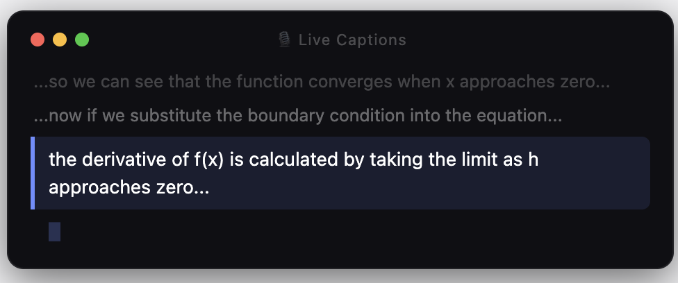

# 🎙 Live Captions

**Real-time speech subtitles, floating on your Mac — so you never miss a word.**

[English](#english) · [中文](#中文)

---

## English

### What is this?

Live Captions is a lightweight macOS floating window that transcribes everything being said around you — **in real time**, using Apple's on-device speech recognition. No internet required, no API keys, no subscriptions.

Built for students attending lectures in a second language, but useful for anyone who thinks better when they can *read* what they're hearing.

<br>



The most recent sentence is **highlighted** with a blue accent bar. Older sentences fade to grey, keeping context visible without distraction.

<br>

### Features

- **Real-time transcription** — Apple SFSpeechRecognizer, fully on-device
- **Always-on-top overlay** — sits over any app, never steals focus
- **Rounded, dark UI** — unobtrusive; feels native on macOS
- **Scroll to review history** — scroll up to browse past sentences, auto-resumes live after 3 seconds
- **Draggable with edge snapping** — stick it to any corner
- **Adjustable opacity** — `⌘=` / `⌘-` to fade in or out
- **Adjustable font size** — `⌘↑` / `⌘↓`
- **Global hotkeys** — `⌘⇧H` hide/show, `⌘⇧C` copy last sentence
- **Save transcript on quit** — asks before saving; goes to `~/Documents/captions/`

<br>

### Requirements

- macOS 13 Ventura or later
- Python 3.11+
- Microphone access + Speech Recognition permission

<br>

### Installation

```bash
git clone https://github.com/LeaiFish/live-captions.git
cd live-captions
pip install -r requirements.txt
```

On first run, macOS will ask for microphone and speech recognition permissions — grant both.

```bash
python main.py
```

<br>

### Controls

| Action | How |
|--------|-----|
| Move window | Drag anywhere |
| Scroll history | Mouse wheel |
| Opacity up / down | `⌘=` / `⌘-` |
| Font larger / smaller | `⌘↑` / `⌘↓` |
| Hide / show window | `⌘⇧H` (global) |
| Copy last sentence | `⌘⇧C` (global) |
| Right-click menu | Right-click or `Ctrl+click` |
| Quit | Click red dot |

<br>

### How it works

```
Microphone → AVAudioEngine → SFSpeechRecognizer → queue → tkinter UI
```

Apple's `SFSpeechRecognizer` streams partial results as you speak. When a sentence is finalized (or after 1.5 seconds of silence), it moves into the scrolling history. Everything stays on-device — no audio ever leaves your Mac.

<br>

---

## 中文

### 这是什么？

Live Captions 是一个 macOS 浮动字幕窗口，利用苹果原生语音识别技术，**实时**将周围的声音转为文字显示在屏幕上。

无需网络、无需 API Key、无需订阅。

最初是为了在英语授课环境中更好地跟上讲座内容而开发的——但凡是"用眼睛读比用耳朵听更容易跟上"的场景，都可以用它。

<br>


### 功能

- **实时语音转文字** — 使用苹果 SFSpeechRecognizer，完全本地运行
- **浮动置顶窗口** — 叠加在任何应用上方，不抢占焦点
- **圆角深色 UI** — 低干扰，视觉上贴合 macOS 风格
- **滚动查看历史** — 滚轮向上翻看历史句子，停止后 3 秒自动回到实时
- **可拖动 + 边缘吸附** — 随意停靠到屏幕角落
- **透明度调节** — `⌘=` / `⌘-`
- **字体大小调节** — `⌘↑` / `⌘↓`
- **全局快捷键** — `⌘⇧H` 隐藏/显示，`⌘⇧C` 复制最后一句
- **退出时保存记录** — 询问是否保存，保存到 `~/Documents/captions/`

<br>

### 系统要求

- macOS 13 Ventura 或更高版本
- Python 3.11+
- 麦克风权限 + 语音识别权限

<br>

### 安装

```bash
git clone https://github.com/LeaiFish/live-captions.git
cd live-captions
pip install -r requirements.txt
```

首次运行时，macOS 会请求麦克风和语音识别权限，两项都需要同意。

```bash
python main.py
```

<br>

### 快捷键一览

| 操作 | 方式 |
|------|------|
| 移动窗口 | 拖动任意位置 |
| 查看历史 | 鼠标滚轮向上 |
| 透明度 +/- | `⌘=` / `⌘-` |
| 字体 +/- | `⌘↑` / `⌘↓` |
| 隐藏/显示 | `⌘⇧H`（全局） |
| 复制最后一句 | `⌘⇧C`（全局） |
| 右键菜单 | 右键或 `Ctrl+点击` |
| 退出 | 点击红色按钮 |

<br>

### 技术原理

```
麦克风 → AVAudioEngine → SFSpeechRecognizer → 队列 → tkinter 界面
```

苹果的 `SFSpeechRecognizer` 在说话过程中持续输出中间结果。句子确认后（或静默 1.5 秒后自动确认），滚入历史记录。所有处理均在本地完成，音频不会离开你的 Mac。

<br>

---

## Project structure

```
live-captions/
├── main.py          # Entry point, poll loop, hotkeys, transcript save
├── window.py        # tkinter Canvas UI, scroll, highlight, rounded corners
├── recognizer.py    # AVAudioEngine + SFSpeechRecognizer wrapper
├── history.py       # Rolling buffer of confirmed sentences
├── requirements.txt
└── tests/
    ├── test_window.py
    └── test_history.py
```

<br>

## License

MIT
